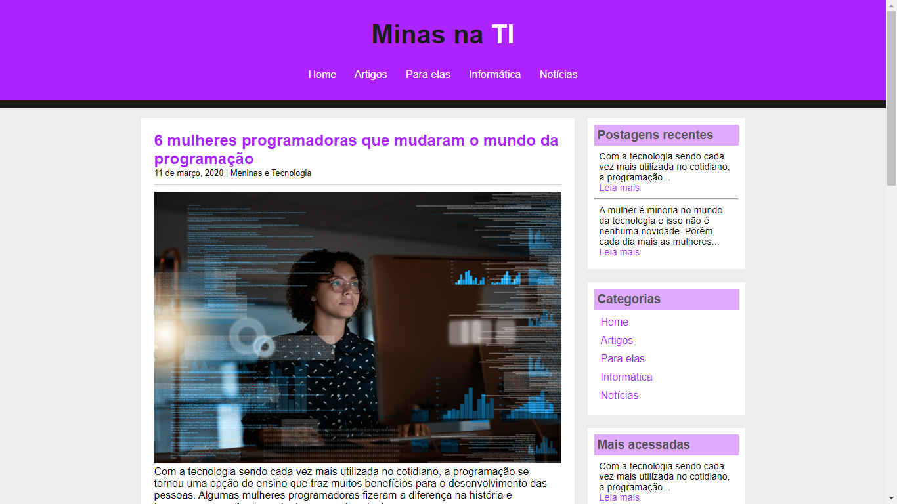

# Blog - Minas na TI! ❤
#### Site desenvolvido com artigos de outros Blogs sobre a importância das mulheres na tecnologia.

Este é o meu terceiro projeto desenvolvido com o objetivo de colocar em prática os conhecimentos obtidos durante o curso de Desenvolvimento Web. Através dos repositórios está sendo possível acompanhar a minha evolução no aprendizado.

 ~ Para este projeto, eu aprendi como atualizar: **Seletores, Formatação de links, Elementos inline, block e inline-block e Modelos de Caixa.**

## Screenshots do site:

